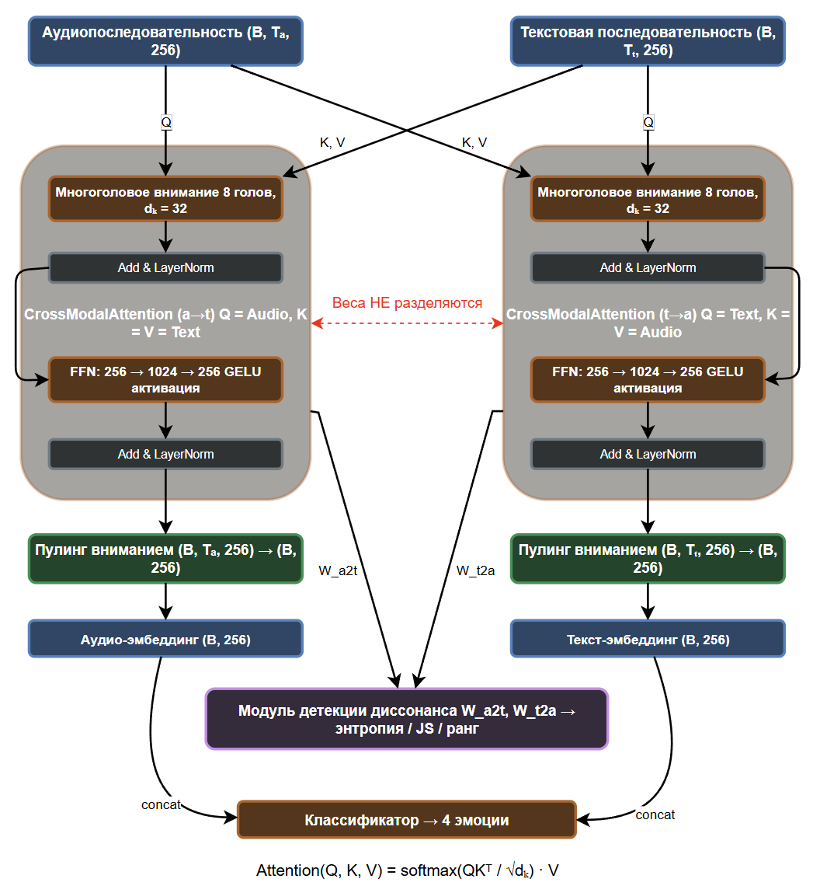

# CODA: Cross-Modal Dissonance Analysis Pipeline

Lightweight multimodal pipeline for Russian dialogue emotion recognition that combines acoustic and semantic modalities through bidirectional cross-modal attention with an inter-modal dissonance detection mechanism.

## Result

**CODA-BiAttn (2.2M params)** achieves **80.83% UA** on the Dusha crowd_test speaker-independent split, outperforming the pre-trained **HuBERT-Large baseline (316M params)** at **79.34% UA** -- a 143x parameter reduction with slightly improved accuracy.

## Architecture



## Models

| Model | Params | UA (%) | Macro F1 (%) |
|-------|--------|--------|--------------|
| HF-HuBERT (audio only) | 95.0M | 72.10 | 71.84 |
| HF-ruBERT (text only) | 178.4M | 72.01 | 71.22 |
| HF-Dusha (pre-trained) | 316.6M | 79.34 | 78.96 |
| CODA-Base | 0.6M | 75.77 | 75.53 |
| CODA-UniAttn | 1.4M | 77.36 | 77.23 |
| **CODA-BiAttn** | **2.2M** | **80.83** | **80.57** |
| CODA-BiAttn-Context | 2.9M | 80.12 | 79.62 |
| CODA-Full | 2.9M | 79.37 | 78.56 |
| CODA-Full-NoProsodic | 2.9M | 78.68 | 78.12 |

## Project Structure

```
CODA_VKR/
├── src/
│   ├── config.py                    # Hyperparameters, paths, constants
│   ├── data/
│   │   ├── dusha_loader.py          # Dusha dataset loader
│   │   ├── preprocessing.py         # Feature extraction pipeline
│   │   ├── prosodic_features.py     # F0, energy, jitter, shimmer, HNR
│   │   ├── occ_mapping.py           # OCC cognitive model label mapping
│   │   ├── dataset.py               # PyTorch Dataset with speaker splits
│   │   └── ...
│   ├── models/
│   │   ├── acoustic_encoder.py      # HuBERT-based audio encoder
│   │   ├── semantic_encoder.py      # ruBERT-based text encoder
│   │   ├── cross_attention.py       # Bidirectional cross-modal attention
│   │   ├── context_encoder.py       # BiLSTM dialogue context
│   │   ├── dissonance_detector.py   # Attention entropy + Isolation Forest
│   │   ├── coda_pipeline.py         # Full CODA model
│   │   └── baselines.py             # HuggingFace baselines
│   ├── training/
│   │   ├── train_coda.py            # CODA training (all variants)
│   │   ├── train_hf_baseline.py     # Audio baseline training
│   │   ├── train_hf_rubert_baseline.py  # Text baseline training
│   │   ├── evaluate.py              # Evaluation on test sets
│   │   ├── eval_dissonance.py       # Dissonance detection evaluation
│   │   └── losses.py                # Weighted cross-entropy loss
│   └── utils/
│       ├── metrics.py               # UA, WA, macro F1, per-class F1
│       ├── export.py                # torchinfo + ONNX export
│       ├── logger.py                # Logging setup
│       └── pipeline_check.py        # Pre-training sanity checks
├── results/
│   ├── metrics/                     # Experiment metrics (JSON/CSV)
│   ├── figures/                     # Generated plots (PNG/PDF)
│   ├── torchinfo/                   # Model architecture summaries
│   ├── logs/                        # Training logs
│   └── onnx/                        # ONNX model exports
└── requirements.txt
```

## Setup

```bash
pip install -r requirements.txt
python -m spacy download ru_core_news_lg
```

## Dataset

This project uses the [Dusha](https://github.com/salute-developers/golos) dataset for Russian speech emotion recognition. Download the dataset separately and place it under `datasets/DUSHA/`.

## Preprocessing

Extract HuBERT embeddings and prosodic features (run once):

```bash
python -m src.data.preprocessing --subset crowd_train
python -m src.data.preprocessing --subset crowd_test
```

## Training

```bash
# Dry run (sanity check)
python -m src.training.train_coda --variant biattn --dry-run

# Full training
python -m src.training.train_coda --variant biattn --seed 42
```

Available variants: `base`, `uniattn`, `biattn`, `biattn_context`, `full`, `full_noprosodic`

## Evaluation

```bash
# Evaluate on crowd_test
python -m src.training.evaluate --model coda_biattn --checkpoint results/checkpoints/coda_biattn/best.pt

# Evaluate HF-Dusha baseline
python -m src.training.eval_hf_dusha_baseline
```

## Citation

If you use this code, please cite:

```
Kaymakcioglu, M. D. (2026). Cross-Modal Dissonance Analysis Pipeline (CODA)
for Russian Dialogue Emotion Recognition. RUDN University.
```

## License

MIT
